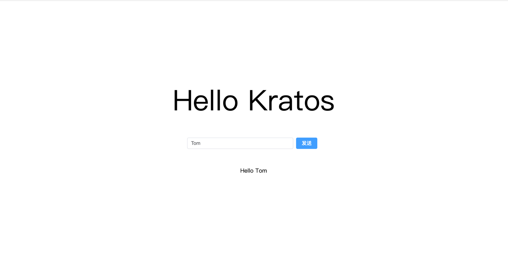

# kratos-grpc-vite

前言：grpc 官方的grpc-web阐述了如何在browser使用grpc与后台服务进行通信，方法是使用protoc将相关proto文件生成commonJs，前端require后进行相关调用。但该方法仅适用于使用webpack构建的项目，使用vite构建的项目并不能正确识别require用法从而导致调用失败。

本demo使用 plugin(protoc-gen-ts, @protobuf-ts)配合protoc生成ts文件,让vite构建的前端项目能顺利的利用grpc与kratos进行通信。


## 技术栈

- [Kratos](https://go-kratos.dev/)
- [vite](https://cn.vitejs.dev/)
- [vue](https://v3.cn.vuejs.org/)
- [element-plus](https://element-plus.org/zh-CN/)
- [grpc-web](https://github.com/grpc/grpc-web)
- [envoy](https://www.envoyproxy.io/)


## Client 客户端
建议使用用webstorm打开

```shell
npm install
npm run dev
```
proto文件构建(本demo已构建好)

```shell
cd proto
protoc -I=./ --ts_out=./ XXXXX.proto
```

## envoy proxy

准备一个 envoy.yaml 文件
监听端口：8080，接受来自browser的请求
然后把gRPC-Web requests转发至kratos服务监听的9000端口

```shell
static_resources:
  listeners:
    - name: listener_0
      address:
        socket_address: { address: 0.0.0.0, port_value: 8080 }
      filter_chains:
        - filters:
          - name: envoy.filters.network.http_connection_manager
            typed_config:
              "@type": type.googleapis.com/envoy.extensions.filters.network.http_connection_manager.v3.HttpConnectionManager
              codec_type: auto
              stat_prefix: ingress_http
              route_config:
                name: local_route
                virtual_hosts:
                  - name: local_service
                    domains: ["*"]
                    routes:
                      - match: { prefix: "/" }
                        route:
                          cluster: greeter_service
                          max_stream_duration:
                            grpc_timeout_header_max: 0s
                    cors:
                      allow_origin_string_match:
                        - prefix: "*"
                      allow_methods: GET, PUT, DELETE, POST, OPTIONS
                      allow_headers: keep-alive,user-agent,cache-control,content-type,content-transfer-encoding,custom-header-1,x-accept-content-transfer-encoding,x-accept-response-streaming,x-user-agent,x-grpc-web,grpc-timeout
                      max_age: "1728000"
                      expose_headers: custom-header-1,grpc-status,grpc-message
              http_filters:
                - name: envoy.filters.http.grpc_web
                  typed_config:
                    "@type": type.googleapis.com/envoy.extensions.filters.http.grpc_web.v3.GrpcWeb
                - name: envoy.filters.http.cors
                  typed_config:
                    "@type": type.googleapis.com/envoy.extensions.filters.http.cors.v3.Cors
                - name: envoy.filters.http.router
                  typed_config:
                    "@type": type.googleapis.com/envoy.extensions.filters.http.router.v3.Router
  clusters:
    - name: greeter_service
      connect_timeout: 0.25s
      type: logical_dns
      http2_protocol_options: {}
      lb_policy: round_robin
      load_assignment:
        cluster_name: cluster_0
        endpoints:
          - lb_endpoints:
            - endpoint:
                address:
                  socket_address:
                    address: 0.0.0.0
                    port_value: 9000
```

如果你的docker 跑在 Mac/Windows系统的话，把最后的 address: 0.0.0.0 改成

```shell
...
    socket_address:
        address: host.docker.internal
```
如果你的docker 跑在 Mac 上，版本低于 v18.03.0, 把最后的 address: 0.0.0.0 改成
```shell
...
    socket_address:
        address: docker.for.mac.localhost
```
把 Envoy proxy 跑起来
```shell
docker run -d -v "$(pwd)"/envoy.yaml:/etc/envoy/envoy.yaml:ro \
    -p 8080:8080 -p 9901:9901 envoyproxy/envoy:v1.22.0
```

如果你的 docker 跑在 Mac/Windows, 去掉 --network=host 选项:
```shell
docker run -d -v "$(pwd)"/envoy.yaml:/etc/envoy/envoy.yaml:ro \
    -p 8080:8080 -p 9901:9901 envoyproxy/envoy:v1.22.0
```
## Server 服务端
把 kratos 服务端跑起来，监听9000端口
```shell
cd server
kratos run
```
##
当上面的一切都做好后，打开你的浏览器，输入
```shell
localhost:3000
```
即可正常通信使用

